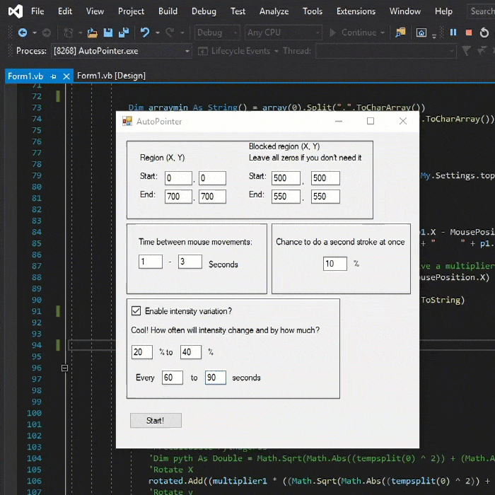

# AutoPointer
Humanlike mouse movement replicator. Proof of concept. Windows only.

## Install

 ```bash
 Unzip Clickdata.zip to "My documents"
 Run AutoPointer.exe
 ```
 
 
 ## Notes:
 
 #### Usage of the mouse movement engine
  ```bash
 movemouse(x, y)
  ```
 
 #### How it works
 This program uses pre-recorded mouse delta movements and millisecond timings and chooses an individual stroke appropriate by length. It rotates the matrix, scales to fit and executes the mouse movement with the speed of windows mouse polling rate. (200Hz)
Clickdata.zip contains 3,280 individual mouse strokes performed on a 1920x1080 screen. The format of the data is: Δx.Δy.Δms and the character "|" as a separator.
 
 #### Personal notes
This program is not quite useful as it is unless you want to cheat an anti-bot system or look like you're busy working. 
The point of this project is the movement engine itself.

This program could easily be made into a dll-file to be used from another language or just easy integration. Same with integrating mousedata in to the program. Am I going to do it though? Nope. But feel free to leave a pull request if you do.
